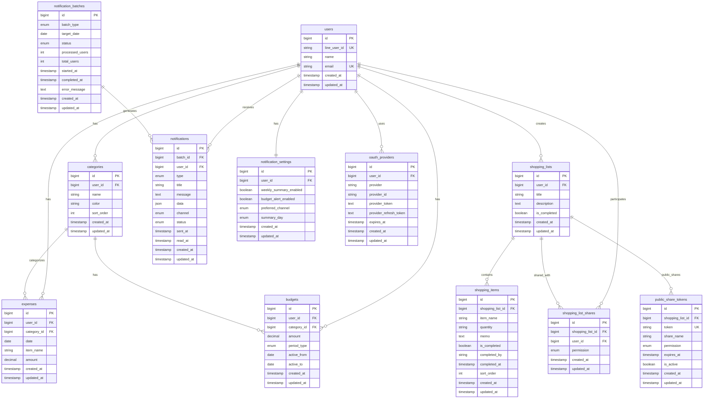

# DB論理設計

## ER図



## Enum定義

### budgets.period_type
```
- monthly: 月次予算
- weekly: 週次予算
```

### shopping_list_shares.permission / public_share_tokens.permission
```
- read: 閲覧のみ
- write: 編集可能
```

### notification_batches.batch_type
```
- weekly_summary: 週次サマリー通知
```

### notification_batches.status
```
- running: 実行中
- completed: 完了
- failed: 失敗
```

### notifications.type
```
- weekly_summary: 週次サマリー通知
- budget_alert: 予算超過アラート
- manual: 手動通知
```

### notifications.channel / notification_settings.preferred_channel
```
- push: プッシュ通知
```

### notifications.status
```
- pending: 送信待ち
- sent: 送信完了
- failed: 送信失敗
```

### notification_settings.summary_day
```
- sunday: 日曜日
- monday: 月曜日
```

## 主要な設計ポイント

### 1. ユーザー認証
- LINEログインに対応（`users.line_user_id`）
- OAuth認証情報を`oauth_providers`で管理
- Laravel Sanctumによるトークン認証

### 2. 買い物メモ共有機能
- システム内ユーザー共有: `shopping_list_shares`テーブル
- システム外ユーザー共有: `public_share_tokens`テーブルでトークンベース認証
- 権限管理（read/write）対応

### 3. 通知・バッチ処理
- 週次バッチ処理の状態管理（`notification_batches`）
- 通知送信履歴の記録（`notifications`）
- ユーザー別通知設定（`notification_settings`）

### 4. 支出・予算管理
- カテゴリ別予算設定
- 期間設定可能（月次/週次）
- 予算有効期間の管理

### 5. 拡張性
- JSONカラムで将来的な機能拡張に対応
- Enum型で値の制約と可読性を確保
